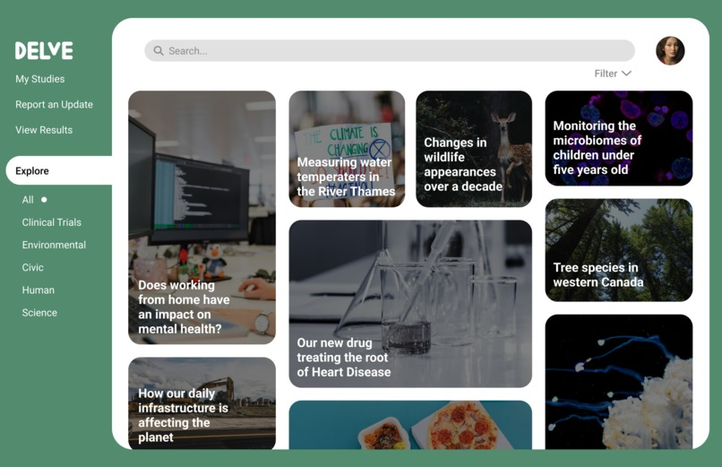

# Delve - nwHacks 2022

## Devpost
https://devpost.com/software/delve-cym968

## Inspiration
Published results show that ‘only 8% of cancer patients enroll in cancer trials’ for reasons including cost, lack of accessibility and lack of flexibility.

## What it does
Delve serves to lower the barrier of entry for finding and participating in clinical trials and studies whilst providing trusted open data to the world. While collaborating with both Researchers and Participants, Delve uses AI to simplify complicated writing with the goal of reducing the spread of fake news.

## How we built it
Low Fi to Mid Fi to High Fi, async building backend and frontend with a final merge and a lot of challenging issues and learning moments.

## Challenges we ran into
Deployment.

## Accomplishments that we're proud of
We managed to get it up and working through the unforseen obstacles.

## What we learned
Even when you've done something countless times, when it goes wrong it can still be very costly. Never be complacent.

## What's next
Polishing the web app, deploying it more securely, and adding & polishing the features.
